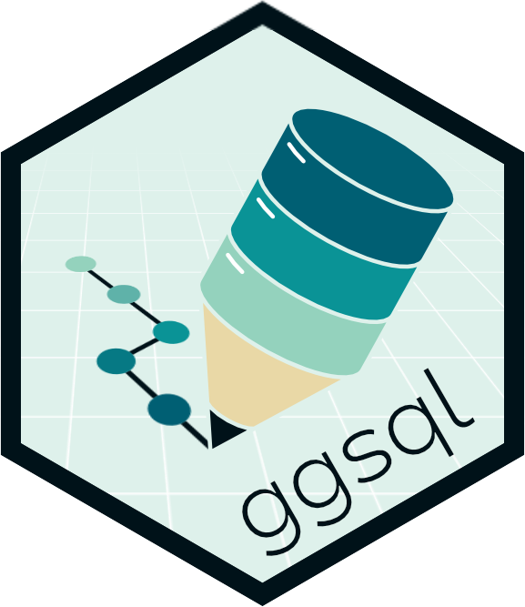
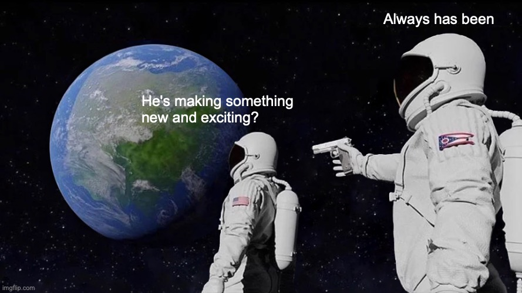
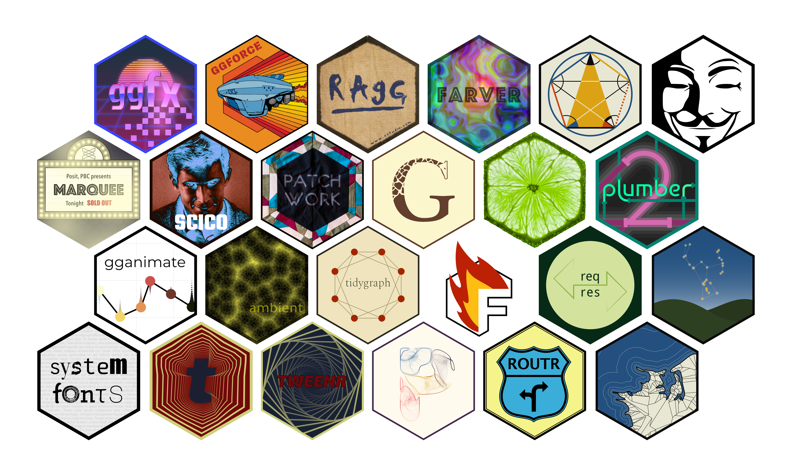
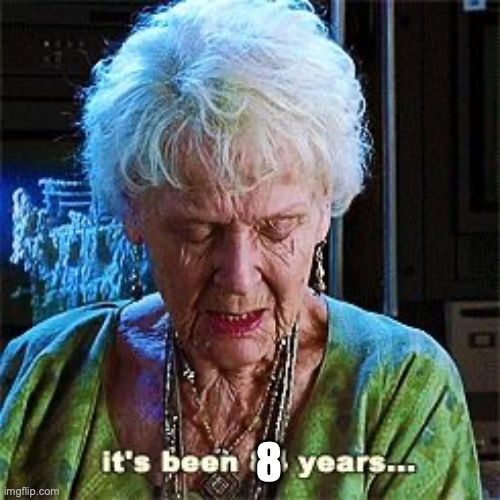
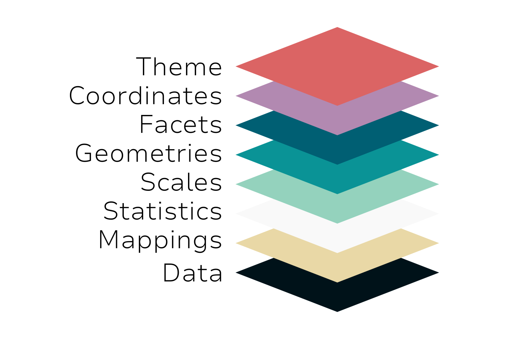

::: {#title-slide}
{.nostretch width="280"}

[A grammar of graphics for SQL]{.title}

[Thomas Lin Pedersen]{.quarto-title-author}

[25th September 2026]{style="font-size:0.8em;"}
:::

::: {.notes}
Hi everyone

Thank you so much for coming today

I'm here to tell you all I can about ggsql: 

Our implementation of the grammar of graphics for SQL
:::

## Why am I speaking to you?

* Software engineer at Posit, PBC
* If you have created graphics in R, my code has probably been involved
* I'm creating something new and exciting

::: {.notes}
I work for Posit which, back in the days were known as RStudio

I've done that since 2018

I've been using R since my first year at the university (KVL) which was back in 2005

I haven't aged a day since then but I've grown more wise

My main focus has for many years been graphics and data visualization

But why am I speaking to you today? Because I'm creating something new and exciting
:::

* * *



::: {.notes}
I've been kinda blessed in this regard

I've always loved creating packages for others to use

Now it's my full time job, which is rare in Open Source
:::

* * *



::: {.notes}
So, I've been prolific when it comes to R packages

And, while some are more niche than others, they are all exciting
:::

## {auto-animate="true" .center}

{fig-align="center"}

::: {.notes} 
Many packages in some way ties into ggplot2

If you are unfamiliar, it is a very popular visualization framework

Has reigned supreme in R for 20 years or so
:::

## {auto-animate="true" .center}

::: {.columns}
::: {.column}

:::

::: {.column}

:::
:::

::: {.notes}
and one of my claims to fame is that I've maintained ggplot2 for 8 years now

this is both a privilege and a burden

Popularity begets constraints

And cost/benefit wise you can't justify anything but incremental polish

But, thinking about visualization frameworks, syntax, theory, etc every day for 8 years+ does provide some very unique insights
:::

## {auto-animate="true" .center}

::: {.columns}
::: {.column width="35%"}

:::

::: {.column width="30%"}
[+ SQL =]{.equation}
:::

::: {.column width="35%"}

:::
:::

::: {.notes}
So, we've taken all of that insight and freed ourselves from the constraint of compatibility by moving to a language historically devoid of visual output

and that is what ggsql is
:::

## Why am I speaking to you? {auto-animate="true"}


::: {.notes}
So, why am I talking to you? 

Because ggsql is very exciting, both to develop, but hopefully also as a user

So, the rest of the talk will be about this

I'll talk a bit about the "Why?" which is somewhat broader than pure ggplot2 escapism

I'll show you what it looks like

And I'll touch on the future for the project
:::

## {.center}

::: {style="text-align: center;"}
[Why ggsql?]{style="font-size:3em;"}
:::

::: {.notes}
So, why ggsql?

I think we were mentally bracing ourselves for that question when we unveiled it

But it never came (much)

So I guess the idea is somewhat as good as we thought

Still, I'd like to take you through some of our thoughts so you can better understand what we are trying to achieve
:::

## Why ggsql?

* SQL is hugely influential and still heavily used
* Many SQL-first or SQL-only data scientists and analysts
* They are massively under-served in tooling *and* visualization
* GoG and SQL just fits so good together that it would be criminal not to

::: {.notes}
So part of this ties into a broader focus expansion at Posit

We are closely tied to R, but our mission is about Data Science in general

And we recognize that many people working with data, be they scientists or analysts are predominantly using SQL

And honestly, we think we can do better, tooling wise, than what currently exist

We want to embrace SQL in a big way

But honestly, the gg and the sql just fits together so well, so even ignoring the above, once you recognize that you kinda have to build it
:::

## A bit about SQL

* One of the oldest programming language still in use
* Based on Relational Algebra (same theoretical backbone as dplyr)
* ANSI SQL (the standard) has been joined by many dialects
* **DECLARATIVE**
* **TABULAR**

::: {.notes}
I'm not going to dive to much into SQL today

SQL users here potentially knows it better than me

R users probably knows enough about it

But, just to sum up some key points

It's old - almost as old as C

It has a strong theoretical foundation (shared with dplyr)

It is one standard with many implementations
:::

## A bit about grammar of graphics

* A theoretical deconstruction of standard plots into core parts
* A theory with many implementations (ggplot2, Vega, D3)
* **DECLARATIVE**
* **TABULAR**

::: {.notes}
So, I'm going to spend a bit more time on the grammar of graphics

If you know ggplot2 this might be rehashing but chances are that you've used ggplot2 without fully diving into it's theoretical backbone

So, the grammar of graphics is a theory defining a set of semantics making it possible to describe plots

Much like relational algebra does for data manipulation

Developed by Leland Wilkinson in 2001

Refined as a base for syntax by Hadley Wickham
:::

## A bit about grammar of graphics



::: {.notes}
The original grammar diverts slightly from this, but we'll stick with Hadleys version

Often presented as a layer of semantics though this is a simplification

The reality is that many of these terms interact in complex ways

Let's walk through them
:::

## A bit about grammar of graphics {.gog-focus-1}

::: {.columns}

:::: {.column}

```{=html}

```
::::

:::: {.column}
* Raw data you want to plot
* In tabular form, one record per row (tidy format)
::::

:::

::: {.notes}
In general the grammar concerns tabular data

One observation per row, variables as columns

No data encoded into column names (no time-10, time-20, time-30 columns)
:::

## A bit about grammar of graphics {.gog-focus-2}

::: {.columns}

:::: {.column}

```{=html}

```
::::

:::: {.column}
* How columns relate to visual aesthetics
* How columns relate to statistical properties
::::

:::

::: {.notes}
Different from assignment

Not "price is x"

But "x relates to price"

A scale handles the "relates" part (coming up)
:::

## A bit about grammar of graphics {.gog-focus-3}

::: {.columns}

:::: {.column}

```{=html}

```
::::

:::: {.column}
* Transformation of observation into derived statistics
* E.g. binning for a histogram
::::

:::

::: {.notes}
Sometimes you just show the raw data (e.g. in a scatterplot)

Many times you don't

The effectiveness of plots is often that they derive valuable statistics from 
data and show that

stats I think, have been one of the more confusing part of ggplot2 for many users

You generally don't have to think about it because it is being applied automatically

A histogram layer knows you want a binned count

But the grammar separates the: what if you want the binned count but don't care much for rectangles in your plot
:::

## A bit about grammar of graphics {.gog-focus-4}

::: {.columns}

:::: {.column}

```{=html}

```
::::

:::: {.column}
* Mapping of measured values to the aesthetic domain
* Definition of mapping function 
::::

:::

:::{.notes}
As talked about, scales define the conversion function between data and visual representation

* input type and range 
* scale type
* (transformation)
* output type and range
:::

## A bit about grammar of graphics {.gog-focus-5}

::: {.columns}

:::: {.column}

```{=html}

```
::::

:::: {.column}
* How to visually represent data
  - point
  - rectangle
  - area
::::

:::

:::{.notes}
Usually what we think of when plotting because it is what we see

Room for radicalism vs pragmatism here
:::

## A bit about grammar of graphics {.gog-focus-6}

::: {.columns}

:::: {.column}

```{=html}

```
::::

:::: {.column}
* Which subset(s) of data to show
* and how...
::::

:::

::: {.notes}
For people unfamiliar with GoG, this is often the weirder one

Think, small multiples

But can be many non-obvious variations of this
:::

## A bit about grammar of graphics {.gog-focus-7}

::: {.columns}

:::: {.column}

```{=html}

```
::::

:::: {.column}
* How the positional aesthetics relate spatially
  - cartesian
  - polar
  - ternary
::::

:::

::: {.notes}
How do you put positions onto a flat paper

Hints at an underlying general relationship not described by the grammar which I have deep thoughts about
:::

## A bit about grammar of graphics {.gog-focus-8}

::: {.columns}

:::: {.column}

```{=html}

```
::::

:::: {.column}
* Non-data-driven styling
  - Title font
  - Panel background color
  - Grid line width
::::

:::

::: {.notes}
A bit lazily "all the rest"

In some sense what gives your plot character 

(for better or worse)
:::

## SQL and GoG {auto-animate="true"}

::: {.quadrants}
::: {data-id="box1" style="background:rgb(219,100,100);"}
[Declarative]{auto-animate-target="none"}
:::

::: {data-id="box2" style="background:rgb(10,147,150);"}
[Modular]{auto-animate-target="none"}
:::

::: {data-id="box3" style="background:rgb(233,216,166);"}
[Composable]{auto-animate-target="none"}
:::

::: {data-id="box4" style="background:rgb(178,137,177);"}
[Speakable]{auto-animate-target="none"}
:::
:::

::: {.notes}
So, with that out of the way we can return to our

*they fit so well together*

argument
:::

## SQL and GoG {auto-animate="true"}

::: {.stack-with-text}
::: {.stack-left}
::: {data-id="box1" style="background:rgb(219,100,100);"}
:::

::: {data-id="box2" style="background:rgb(10,147,150);"}
:::

::: {data-id="box3" style="background:rgb(233,216,166);"}
:::

::: {data-id="box4" style="background:rgb(178,137,177);"}
:::
:::

::: {.stack-text}
* These qualities makes for exceptional software
* They are good for humans
* They are good for LLMs
:::
:::

::: {.notes}
Not every tool needs a theoretical foundation but those that have are often superior

When tools align foundationally they work well together

I don't know what this crazy timeline we're on will bring. 

I do think we will write less code

But I also think that we will read a lot of code

Syntax is as important in this scenario
:::

## {.center}

::: {style="text-align: center;"}
[Demo time]{style="font-size:3em;"}
:::

## [&#8201;]{.rhombus style="background:rgb(0,18,25);"} Data

```{ggsql}
SELECT * FROM ggsql:penguins
LIMIT 14
```

* * *

## [&#8201;]{.rhombus style="background:rgb(233,216,166);"} Mappings

```{ggsql}
SELECT * FROM ggsql:penguins
VISUALIZE 
  bill_len AS x, 
  bill_dep AS y, 
  species AS fill
DRAW point

/*
penguins |>
  ggplot(
    aes(
      x = bill_len, 
      y = bill_dep, 
      color = species
    )
  ) + 
  geom_point()
*/
```

* * *

## [&#8201;]{.rhombus style="background: #F9F9F9;"} Statistics

```{ggsql}
SELECT * FROM ggsql:penguins
VISUALIZE 
  species AS x, 
  body_mass AS y,
  species AS fill
DRAW boxplot

/*
penguins |>
  ggplot(
    aes(
      x = species, 
      y = body_mass, 
      fill = species
    )
  ) + 
  geom_boxplot()
*/
```

* * *

## [&#8201;]{.rhombus style="background: #F9F9F9;"} Statistics

```{ggsql}
SELECT * FROM ggsql:penguins
VISUALIZE 
  bill_dep AS x, 
  bill_len AS y
DRAW point
  MAPPING species AS fill
DRAW point
  SETTING 
    aggregate => 'mean',
    fill => 'red',
    size => 15
  PARTITION BY species
```

* * *

## [&#8201;]{.rhombus style="background: #F9F9F9;"} Statistics

```{ggsql}
SELECT * FROM ggsql:penguins
VISUALIZE 
  bill_dep AS x, 
  bill_len AS y
DRAW point
  MAPPING species AS fill
DRAW range
  MAPPING bill_len AS ymin, bill_len AS ymax
  SETTING 
    aggregate => ('x:mean', 'ymin:min', 'ymax:max')
  PARTITION BY species
```

* * *

## [&#8201;]{.rhombus style="background:rgb(148,210,189);"} Scales

```{ggsql}
SELECT * FROM ggsql:penguins
VISUALIZE 
  bill_dep AS x, 
  bill_len AS y,
  body_mass AS size
DRAW point
SCALE size FROM (0, null) TO (0, 10)

/*
penguins |>
  ggplot(
    aes(
      x = bill_dep, 
      y = bill_len, 
      size = body_mass
    )
  ) + 
  geom_point() + 
  scale_size(
    limits = c(0, NA), 
    range = c(0, 10)
  )
*/
```

* * *

## [&#8201;]{.rhombus style="background:rgb(10,147,150);"} Geometries

```{ggsql}
SELECT * FROM ggsql:penguins
VISUALIZE 
  species AS x, 
  body_mass AS y,
  species AS fill
DRAW boxplot
  SETTING side => 'left'
DRAW violin
  SETTING side => 'right'
DRAW point
  MAPPING null AS fill
  SETTING 
    position => 'jitter',
    distribution => 'density',
    side => 'right',
    size => 1
```

* * *

## [&#8201;]{.rhombus style="background:rgb(0,95,115);"} Facets

```{ggsql}
SELECT * FROM ggsql:penguins
VISUALIZE 
  bill_len AS x, 
  bill_dep AS y, 
  species AS fill
DRAW point
FACET island
```

* * *

## [&#8201;]{.rhombus style="background:rgb(0,95,115);"} Facets

```{ggsql}
SELECT * FROM ggsql:penguins
VISUALIZE 
  bill_len AS x, 
  bill_dep AS y, 
  species AS fill
DRAW point
FACET body_mass
SCALE BINNED panel
  SETTING breaks => (2000, 3000, 4000, 5000, 6000, 7000)
```

* * *

## [&#8201;]{.rhombus style="background:rgb(178,137,177);"} Coordinates

```{ggsql}
SELECT * FROM ggsql:penguins
VISUALIZE species AS fill
DRAW bar
PROJECT TO polar
```

* * *

## [&#8201;]{.rhombus style="background:rgb(178,137,177);"} Coordinates

```{ggsql}
#| classes: "visually-hidden"
INSTALL spatial;
```

```{ggsql}
WITH data(island, lat, lon) AS (
  VALUES
    ('Torgersen', -64.77, -64.08),
    ('Dream',    -64.73, -64.23),
    ('Biscoe',   -65.43, -65.50)
)
SELECT * FROM data

VISUALIZE *
DRAW spatial
  MAPPING FROM ggsql:world
DRAW point
  MAPPING island AS fill
PROJECT TO orthographic
  SETTING 
    origin => (-64.8, -65.1),
    bounds => (-150000, -150000, 150000, 150000)
```

* * *


## [&#8201;]{.rhombus style="background:rgb(219,100,100);"} Theme

TBD, but...

## [&#8201;]{.rhombus style="background:rgb(219,100,100);"} Theme

```{ggsql}
VISUALIZE species AS fill, species AS x FROM ggsql:penguins
DRAW bar
SCALE fill TO ('steelblue', 'goldenrod', 'forestgreen')
LABEL 
  title => 'Distribution of penguin (*Pygoscelis*) species',
  subtitle => 'This plot focuses on 3 species: {.steelblue *P. adeliae*}, {.goldenrod *P. antarcticus*}, {.forestgreen *P. papua*}'
```

* * *

## So, what is this witchcraft actually?

* ggsql is written in pure Rust
* We currently provide:
  - A CLI
  - A Positron/VS Code extension
  - A Jupyter kernel
  - R and Python bindings
  - A DuckDB extension
  - A WebAssembly binary

::: {.notes}
ggsql is, in some sense, many things

we have grappled with naming exactly what it is

is it a package

an SQL dialect

A reference implementation of a new derived programming language

maybe the fine print doesn't matter that much
:::

## ggsql in Positron

* We are leveling up our SQL love in Positrion
* Positron *will be* the best place to run SQL
* ggsql is a big part of that equation

::: {.notes}
As I hinted at in the beginning, we are aiming a huge spotlight on SQL

We want you to want to use positron for SQL work

By extension, even if ggsql can be used in many ways, we want positron to give the best experience
:::

## ggsql in Quarto/Jupyter

* The Jupyter kernel makes ggsql work automatically
* The R bindings provide a knitr engine
  - Run R, Python, and ggsql in the same document
  - Share data automatically between the processes

::: {.notes}
A notebook is probably the easiest entry for now

Just install the kernel and create a quarto document with ggsql code blocks
:::

## My data lives in PostgreSQL

### Now what?

* ggsql is built to interact directly with your database
* Can interact with most through ODBC/ADBC driver support
* (All) computations are send to the backend
* Only data needed for plotting is returned

::: {.notes}
During all this I've used built in data or perhaps a csv file here and there

You probably don't work exclusively with penguin research
:::

## {.center}

::: {style="text-align: center;"}
We want to meet you were your data is
:::

::: {.notes}
Bottom line is we don't want to force yet-another-tool on you

We just want to meet you were you currently are
:::

## What's in the future?

* gt inspired table formatting
* patchwork inspired plot composition
* Interactivity

## {.center}

::: {style="text-align: center;"}
Questions

[...or perhaps a demo of something cool]{style="font-size:0.7em;"}
:::
